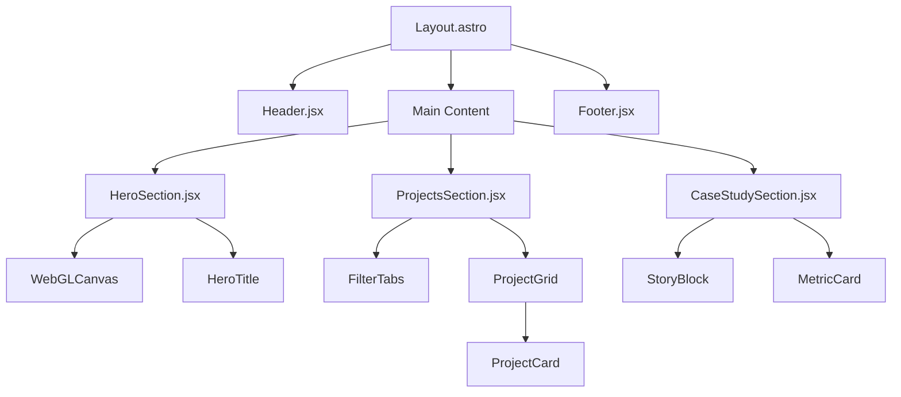

# Документация проекта: Interactive Developer Portfolio (IDP)

## Содержание
1. [Product Requirements Document (PRD)](#1-product-requirements-document-prd)
2. [Технические спецификации](#2-технические-спецификации)
3. [Архитектура и спецификации компонентов](#3-архитектура-и-спецификации-компонентов)
4. [План реализации (Roadmap)](#4-план-реализации-roadmap)

---

## 1. Product Requirements Document (PRD)

### 1.1. Обзор проекта
**Название:** Interactive Developer Portfolio (IDP)  
**Цель:** Создать запоминающееся портфолио веб-разработчика, которое выделяется нестандартным дизайном (IDE-эстетика, WebGL-фон) и интерактивностью, демонстрируя навыки фронтенд-разработки на высоком уровне. Проект должен выглядеть как «терминал» или «среда разработки», но оставаться удобным для HR и клиентов.

### 1.2. Целевая аудитория
*   **HR и рекрутеры:** Ищут конкретные навыки (стек) и проекты. Ценят быстрый доступ к резюме и контактам.
*   **Tech Lead / Senior Developers:** Оценивают качество кода, архитектуру и визуальный вкус. Обращают внимание на детали (анимации, верстка).
*   **Потенциальные клиенты:** Ищут исполнителя. Им важны кейсы и понятное описание услуг.

### 1.3. Функциональные требования (Features)

#### F1. Immersive Hero Section (Immersive-вступление)
*   **Описание:** Полноэкранный блок с WebGL-анимацией на фоне.
*   **Детали:**
    *   Фоновая 3D-сцена (WebGL), реагирующая на движение мыши (параллакс).
    *   Заголовок с «глитч»-эффектом или эффектом печатания.
    *   Стек технологий в виде «тегов» терминала/IDE.

#### F2. Journal-style Project Grid (Сетка проектов)
*   **Описание:** Блок с проектами, выполненный в стиле журнальной верстки.
*   **Детали:**
    *   Фильтрация проектов по категориям (Frontend, Backend, Pet-проекты).
    *   Анимация появления карточек при скролле (fade-in + slide-up).
    *   Hover-эффекты: плавное увеличение карточки и появление краткого описания.

#### F3. Story-driven Case Study (Кейс-стори)
*   **Описание:** Детальная секция для главного проекта, рассказанная как история решения проблемы.
*   **Детали:**
    *   Scroll-driven анимация: элементы появляются последовательно по мере прокрутки.
    *   Визуализация метрик с анимацией счетчиков.
    *   Блоки кода в стиле IDE (подсветка синтаксиса).

#### F4. Developer Aesthetic (IDE-эстетика)
*   **Описание:** Визуальный стиль, имитирующий среду разработки.
*   **Детали:**
    *   Темная тема по умолчанию (Dark Mode First).
    *   Шрифт кода (monospace) для акцентов.
    *   Декоративные элементы: «номера строк», иконки файлов, бейджи статусов.

#### F5. Micro-interactions & UI
*   Кастомный курсор (опционально).
*   Плавная прокрутка (Smooth Scroll).
*   Доступная навигация с соцсетями, доступная без скролла вниз.

### 1.4. Нефункциональные требования
*   **Производительность:** Google Lighthouse Score > 90. WebGL не должен блокировать основной поток.
*   **Адаптивность:** Mobile-first подход. На мобильных устройствах WebGL заменяется статичным градиентом.
*   **Доступность (a11y):** Контрастность текста, поддержка клавиатурной навигации, правильные ARIA-метки.

---

## 2. Технические спецификации

### 2.1. Стек технологий
*   **Фреймворк:** Astro (v4+) — *для статичной основы и SEO.*
*   **UI-библиотека:** React (v18+) — *для интерактивных «островов» (Hero, Cards, Filters).*
*   **Стилизация:** CSS Modules (Scoped Styles).
*   **3D / WebGL:** Three.js + React Three Fiber (R3F) + Drei.
*   **Анимации:** Framer Motion (React-анимации).
*   **Инструменты:** TypeScript, ESLint, Prettier.

### 2.2. Структура проекта
```text
/
├── public/
│   ├── fonts/          # JetBrains Mono, Inter
│   └── images/         # Скриншоты проектов, аватар
├── src/
│   ├── components/
│   │   ├── common/     # Button, Input, Tag (React)
│   │   ├── layout/     # Header, Footer (Astro/React)
│   │   ├── sections/   # Hero, ProjectsGrid, CaseStudy (React)
│   │   └── three/      # WebGL сцены (R3F)
│   ├── styles/
│   │   └── global.css  # Переменные, ресет, шрифты
│   ├── data/
│   │   └── projects.ts # Массив данных о проектах
│   └── pages/
│       └── index.astro # Главная страница
└── package.json
```

### 2.3. Дизайн-система (CSS Variables)
Используем тему "Cyberpunk Terminal".

```css
:root {
  /* Цвета */
  --bg-primary: #0a0a0a;
  --bg-secondary: #141414;
  --bg-card: #1f1f1f;
  --accent-primary: #00ff9d; /* Неоновый зеленый */
  --accent-secondary: #7b61ff; /* Фиолетовый */
  --text-primary: #e0e0e0;
  --text-secondary: #a0a0a0;
  
  /* Типографика */
  --font-main: 'Inter', sans-serif;
  --font-code: 'JetBrains Mono', monospace;
  
  /* Эффекты */
  --glow-accent: 0 0 20px rgba(0, 255, 157, 0.3);
  --border-radius: 8px;
}
```

---

## 3. Архитектура и спецификации компонентов

### 3.1. Дерево компонентов (Component Tree)



### 3.2. Спецификации компонентов с визуальными примерами

#### Компонент: `<HeroSection />`
**Зона:** 100vh (Первый экран).  
**Функция:** Зацепить внимание, показать WebGL-фон.

> **[ВИЗУАЛЬНЫЙ ПРИМЕР 1: Макет Hero-секции]**
> *Описание:* Фон черный (#0a0a0a). По центру — полупрозрачная геометрическая фигура (wireframe), светящаяся фиолетовым.
> *Передний план:*
> 1. Крупный заголовок: "FRONTEND DEVELOPER" (шрифт JetBrains Mono).
> 2. Подзаголовок серым цветом: "Создаю интерфейсы, которые работают и восхищают".
> 3. Снизу две «таблички» в стиле кода: `<span>React</span>`, `<span>TypeScript</span>`.

#### Компонент: `<ProjectCard />`
**Зона:** Сетка проектов.  
**Функция:** Превью проекта с hover-эффектом.  
**Пропсы:** `title`, `description`, `tags`, `imageUrl`.

> **[ВИЗУАЛЬНЫЙ ПРИМЕР 2: Состояние Hover]**
> *Описание:* Карточка немного увеличивается (scale 1.02) и всплывает вверх. Появляется неоновая зеленая тень вокруг карточки.
> *Внутри:* Размытый фон-скриншот. Сверху темный оверлей. Текст: Заголовок (зеленый), Описание (серый), внизу кнопка "View Case ->".

#### Компонент: `<CaseStudySection />`
**Зона:** Средняя часть страницы.  
**Функция:** Повествование о проекте.

> **[ВИЗУАЛЬНЫЙ ПРИМЕР 3: Лейаут Кейса]**
> *Описание:* Горизонтальная компоновка. Слева — вертикальная линия, имитирующая "Timeline" или номера строк кода.
> *Справа блоки:*
> 1. Блок "The Challenge" с иконкой ошибки.
> 2. Окно "Code Snippet" с подсветкой синтаксиса решения.
> 3. Блок "Results" с крупными цифрами метрик (например, "99.9% Uptime").

#### Компонент: `<Header />`
**Зона:** Фиксированный верх.  
**Функция:** Навигация.  
**Стиль:** Glass-morphism (размытие фона).

> **[ВИЗУАЛЬНЫЙ ПРИМЕР 4: Хедер]**
> *Описание:* Прозрачная полоска с размытием фона. Слева: Логотип `DevName { }`. Справа: Ссылки "Projects", "About" моноширинным шрифтом. В углу иконки соцсетей в цвет акцента.

---

## 4. План реализации (Roadmap)

1.  **Настройка окружения:**
    *   Инициализация Astro (`npm create astro@latest`).
    *   Установка React, Three.js, Framer Motion.
    *   Настройка `global.css` и переменных.

2.  **Верстка базового лейаута:**
    *   Создание `Layout.astro`.
    *   Компонент `Header.jsx` (position: fixed).

3.  **Разработка Hero Section:**
    *   Интеграция React Three Fiber.
    *   Создание простой 3D сцены (вращающийся куб/тор).
    *   Наложение типографики.

4.  **Проекты и Данные:**
    *   Создание файла `projects.ts` с данными.
    *   Реализация `ProjectCard.jsx` и CSS Modules для него.
    *   Верстка сетки (CSS Grid).

5.  **Анимации и Логика:**
    *   Подключение `Framer Motion` для появления элементов при скролле.
    *   Добавление фильтрации проектов.

6.  **Финализация:**
    *   Проверка адаптивности (Mobile View).
    *   Оптимизация изображений.
    *   Тестирование производительности (Lighthouse).
